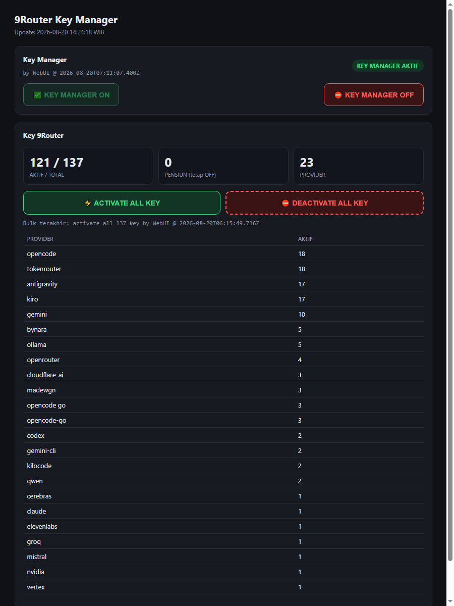

# 9RKM — 9Router Key Manager & Ops Suite

Supporting tooling for a self-hosted [9Router](https://www.npmjs.com/package/decolua/9router) LLM gateway deployment: an API-key lifecycle manager (9RKM), a multi-bot Telegram hub, quality monitors, and watchdogs. Pure Python stdlib + one single-file HTML dashboard. No secrets ever live in this repo.

> The 9Router engine itself is the upstream npm package — this repo only contains custom supporting code around it.

## What's inside

| File | Role |
|---|---|
| `key_manager.py` | **9RKM** — key-manager daemon: 5s error scan → auto-OFF, 5-hour reset + combo-remap cycle, retire logic, Web UI |
| `aa_rank.py` | Discovers every active provider catalog, ranks candidates by Artificial Analysis, probes best-to-worst until one works, then writes one model/provider/combo |
| `9rkm-index.html` | 9RKM Web UI (dark theme, single file, no build step) |
| `9rkm.service` | systemd unit for the daemon |
| `bot_hub.py` | **Bot Hub** — single poller for multiple Telegram bots, HTTP-dispatches updates to each project (avoids Telegram 409 conflicts) |
| `bot-hub-registry.example.json` | Registry template: bot → patterns → HTTP target |
| `bot-hub.service` | systemd unit for the hub |
| `tg_notify.py` | Shared Telegram notifier (credentials from external env file) |
| `gateway-quality-monitor.py` | Error-rate sensor + tool-calling canary (anti silent-degradation) |
| `health-models.py` | Daily health check for every model in a combo; 3 consecutive failures → alert |
| `9r-abort-monitor.py` | Log tripwire for upstream aborts / token-refresh failures |
| `healthcheck-9router.sh` | Port watchdog with auto-restore (cron `*/5`) |

## 9RKM — how it works

```
                  ┌─────────────────────────────────────┐
 requestDetails ─┤  scan thread (every 5s)             │
 (gateway log)   │  fresh errorCode → key OFF          │──► web_alerts.json
                  ├─────────────────────────────────────┤
                  │  cycle thread (every 5h)            │
                  │  discover/rank/probe → remap combos  │──► SQLite combos
                  │  E2E OK → reset keys ON              │
                  │  one active model/provider/combo     │
                  ├─────────────────────────────────────┤
                  │  HTTP thread (Web UI + API)         │◄── browser / curl
                  └─────────────────────────────────────┘
```

- **Auto-OFF**: a key with a gateway-set `errorCode` (fresh ≤1h, no success after it) is deactivated within 5 seconds. Probes/scan activity during a remap cycle is paused so test traffic can never disable keys.
- **Reset cycle + remap**: every 5 hours the remap runs first (fresh Artificial Analysis scores + live catalog discovery, candidates probed best-to-worst per provider until HTTP 2xx, one model per provider per combo). Only after a successful remap + E2E are all keys re-enabled and their error state cleared — a failed remap leaves the DB untouched (combo rollback + no key reset).
- **No retire**: keys are never permanently retired. A key that keeps failing cycles is surfaced in the UI as "OFF berulang (≥3 siklus)" so the root cause gets investigated — every cycle it gets re-tested automatically.
- **Bulk ops**: ACTIVATE ALL / DEACTIVATE ALL from the Web UI (with confirmation dialog).
- **Toggle**: the whole auto-OFF mechanism can be paused from the UI; state persists in the gateway's `kv` table. Toggle OFF also stops remap scheduling.



## Bot Hub — one poller, many bots

Telegram allows only **one `getUpdates` poller per bot token** (a second poller gets `409 Conflict`). The hub solves this for multi-project VPS setups:

```
 bot A token ─┐                        ┌─► POST /api/tg → project 1 (replies itself)
 bot B token ─┼─► bot_hub.py (pollers) ─┤
 bot N token ─┘   pattern routing       └─► POST /api/tg → project 2 (replies itself)
```

- One long-poll thread per token; offset bookkeeping owned by the hub.
- Routing is pure substring/pattern match from `bot-hub-registry.json` (`"*"` = catch-all).
- Projects receive the raw update JSON and reply with their own token — no shared state.
- `--dry` (log only, no forward) and `--bots id1,id2` (subset) flags for testing.

## Quickstart

```bash
# 1. credentials file (never committed), e.g. /home/ubuntu/scripts/daily-key-check.env:
#    BOT_TOKEN=123456:ABC...
#    CHAT_ID=your-chat-id

# 2. run the daemon
export ROUTER_DB=/home/ubuntu/.9router/db/data.sqlite
export TG_ENV=/home/ubuntu/scripts/daily-key-check.env
export RKM_HTTP_HOST=127.0.0.1        # or your Tailscale IP for remote access
python3 key_manager.py

# 3. (optional) install as a service
sudo cp 9rkm.service /etc/systemd/system/ && sudo systemctl enable --now 9rkm

# 4. (optional) bot hub — copy the registry example, edit targets, then:
sudo cp bot-hub.service /etc/systemd/system/ && sudo systemctl enable --now bot-hub
```

## Configuration

Everything is env-driven; defaults assume a standard VPS layout.

| Env var | Default | Used by |
|---|---|---|
| `ROUTER_DB` | `/home/ubuntu/.9router/db/data.sqlite` | all Python scripts |
| `TG_ENV` | `/home/ubuntu/scripts/daily-key-check.env` | `tg_notify.py` (BOT_TOKEN + CHAT_ID) |
| `RKM_HTTP_HOST` / `RKM_HTTP_PORT` | `127.0.0.1` / `8819` | `key_manager.py` |
| `RKM_UI_PATH` | `/home/ubuntu/scripts/9rkm` | `key_manager.py` |
| `GQM_PUBLIC_PROVIDERS` | *(empty)* | `gateway-quality-monitor.py` — comma-separated provider IDs excluded from error-rate |
| `GQM_CANARY_MODEL` | *(empty → canary skipped)* | `gateway-quality-monitor.py` |
| `HM_COMBO` / `HM_VAULT` | `Free` / *(empty)* | `health-models.py` |
| `HC_LOG` / `HC_VAULT` / `HC_TG_ENV` | VPS paths | `healthcheck-9router.sh` |

## Not in this repo (runtime only)

- `.9router/db/data.sqlite` — provider keys + traffic
- `jwt-secret`, `auth/` — gateway auth
- any `.env*` file — credentials (`.gitignore` enforced, files kept mode 600)

## License

MIT
